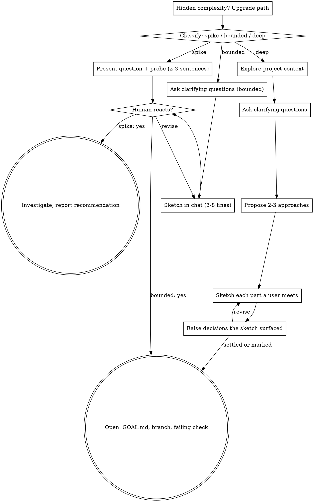

# Brainstorming Ideas Into Sketches

Help turn an idea into something the user can react to, through natural
collaborative dialogue.

This skill owns the conversation that happens *before* work starts. It does not
own the loop, the decision rule, or where anything is written down —
`ENGINE.md` owns those, and this skill hands back to it. Concretely: this skill
covers **Orient → Choose → Sketch**, and stops at the moment `GOAL.md` is
written.

Start by classifying how much conversation the request needs, then work through
your path: understand the context, refine the idea, show a sketch, and get your
human partner's reaction.

## Establish Shared Understanding

The outcome of brainstorming is an understanding your human partner can
recognize and correct, grounded in what they want to accomplish.

1. **Discover intent.** Use the request and available context to identify the
   intended outcome, who it is for, and what success looks like. When that
   information is missing, ask one focused question about purpose or intended
   use before proposing features or an approach. Knowing the app genre does not
   tell you why your partner wants it. Gathering missing requirements does not
   ask them to authorize the task again.
2. **Write back your understanding.** Summarize the intended outcome, relevant
   constraints, and success criteria in a short note your partner can assess.
   Separate what they said from assumptions. Invite correction and incorporate
   their answer before treating this as settled.
3. **Carry intent into the goal.** The agreed understanding becomes the `Why
   now:` and `Done when:` lines of `GOAL.md`. Check proposed features and
   technical choices against it.

When the request already supplies the purpose and constraints, reflect that
understanding instead of asking the same questions again. Keep the note
concise; its accuracy and the opportunity to correct it matter.

<HARD-GATE>
Before taking any implementation action — writing product code, scaffolding,
installing product dependencies, creating an external project — complete the
selected path's prerequisites:

- Spike: the human partner approves the question and probe.
- Bounded: the human partner has seen the short in-chat sketch.
- Deep: the human partner has seen the sketch and answered the decisions it
  raised.

The gate is the sketch, not a specification. Do not write a specification
document in advance of the work and do not ask for approval of one; the product
is specified one decision at a time, as the work reaches each decision. A reply
reacts to the sketch actually shown. Read-only project exploration is allowed
while these prerequisites remain incomplete.
</HARD-GATE>

## Three Paths

Before your first question, classify the request and say the classification out
loud — "this looks bounded, so I'll sketch it here in a few lines" — so your
human partner can override it:

- **Spike** — a feasibility question ("can we...", "is it possible...", "quick
  and dirty is fine") whose output is an answer, not code you keep. Present the
  question and what you'll try in 2-3 sentences, get a nod, then find out as
  cheaply as correctness allows. Report findings as a recommendation; anything
  you built stays labeled throwaway. This is an `investigation` goal.
- **Bounded** — a well-scoped change to code that already exists in this repo: a
  new flag, a small endpoint, a one-file fix. Understanding the kind of app is
  not enough — bounded means the flow you are changing is already here to read.
  If there is no existing flow to change, the task is not bounded. Ask the
  clarifying questions that matter, sketch it in three to eight lines, and stop
  long enough for a reaction. This is a `change` goal.
- **Deep** — new projects, new subsystems, changes that restructure how
  components fit together or alter interfaces others depend on. Same
  destination, more conversation on the way: context, questions one at a time,
  2-3 approaches with trade-offs, a sketch per part that a user meets. This is
  also a `change` goal; what makes it deep is the number of decisions it
  raises, not a heavier artifact at the end.

When in doubt between two paths, take the heavier one. The ratchet is one-way:
hidden complexity discovered mid-task upgrades the path — stop, say so, and step
up. Nothing downgrades mid-task.

## Anti-Pattern: "Too Simple To Sketch"

Every path that changes something a user meets shows a sketch before the work.
A bounded change may need only three lines. Scale the sketch to the path; do not
scale it away.

The opposite failure costs as much: a sketch is not a definition, carries no
approval ceremony, names no files, and settles nothing a user would not notice.
Turning it into a document is the same mistake as skipping it.

## Red Flags

| Thought | Reality |
|---------|---------|
| "This is too simple to sketch" | Three lines still beat starting blind. If a user meets it, show it first. |
| "I'll write a spec so we agree up front" | The product is specified one decision at a time, as the work reaches them. A spec written in advance guesses the answers. |
| "It's bounded and the sketch is obvious — I'll start while they read it" | Showing and starting in the same breath means the reaction arrives too late to be free. |
| "I understand this kind of app, so it's bounded" | Bounded measures the repo, not your familiarity. A new project has no existing flow — it is deep. |
| "The spike works, so I'll keep the code" | A spike's output is an answer. Keeping the code is a new request — classify it. |
| "It grew, but I'm almost done — no need to re-classify" | Hidden complexity upgrades the path mid-task. Stop and say so. |
| "They approved the spike, so the follow-up change is approved too" | Each task gets its own classification and its own sketch. |
| "I'll pick the conventional answer and move on" | For a decision a user would notice and nobody has settled, the conventional answer is the one thing they are not here for. Raise it. |

## Decisions

`ENGINE.md` owns the rule for which decisions are yours and which are the
user's. Two consequences matter constantly while brainstorming:

- **A bounded decision** — known space, only needs settling — gets 2-4 concrete
  options, the trade-off in a line, and your recommendation.
- **An opening decision** — what should this be, how should it feel, what is the
  idea — is the user's to originate. Ask it open, sketch at most, recommend
  nothing first.

Number every list you put to the user, and keep the labels stable while that
list is under discussion.

Answers land in the artifact that owns them, named by the README's index — not
in a new document written for this conversation. A decision you could not get
an answer to becomes the cheapest-to-swap default, marked `PROVISIONAL`, and is
listed at the review.

## Checklist

Classify first, announce the path, then create a task for each item on your path
and complete them in order.

**Spike:**
1. **Explore project context** — enough to frame the probe
2. **Present question + probe plan** — 2-3 sentences
3. **Get approval** — a nod is enough
4. **Open** — `GOAL.md` with `Shape: investigation`, naming the question and the
   file the finding lands in
5. **Investigate** — as cheaply as correctness allows
6. **Report findings** — a recommendation; label anything built as throwaway

**Bounded:**
1. **Explore project context** — `PRODUCT.md`, the README's index, recent
   commits, `grep -rn PROVISIONAL`
2. **Ask clarifying questions** — one at a time, the ones that matter
3. **Sketch in chat** — three to eight lines of what the user will see and do;
   number alternatives `S1`, `S2`
4. **Take the reaction** — stop long enough for one; revise if it comes
5. **Hand off to the engine** — `ENGINE.md` §4 Open: write `GOAL.md`, branch,
   write the failing check

**Deep:**
1. **Explore project context** — as above
2. **Offer the visual companion just-in-time** — NOT upfront. The first time a
   question would genuinely be clearer shown than described, offer it then (its
   own message); on approval its browser tab opens for you. If no visual
   question ever arises, never offer it. See the Visual Companion section below.
3. **Ask clarifying questions** — one at a time, understand purpose,
   constraints, success criteria
4. **Propose 2-3 approaches** — with trade-offs and your recommendation
5. **Sketch each part a user meets** — one picture or a few lines per part,
   taking the reaction to each before moving on
6. **Raise the decisions the sketch surfaced** — bounded ones with options and a
   recommendation, open ones asked open
7. **Hand off to the engine** — `ENGINE.md` §4 Open: write `GOAL.md`, branch,
   write the failing check

## Process Flow

**Every path ends at the engine.** Bounded and deep terminate at `ENGINE.md` §4
Open — `GOAL.md`, the branch, the failing check — and implementation proceeds
through §5 Work. A spike terminates at a reported recommendation. Do not invoke
another skill as a terminal state.

## The Process

The subsections below serve the bounded and deep paths (a spike stops at
"present the probe, get a nod"). Sections from **Exploring approaches** onward
are deep-path depth — for bounded work, context plus a few questions plus a
short sketch is the whole process.

**Understanding the idea:**

- Check out the current project state first: `PRODUCT.md`, the README's index of
  where decided truth lives, recent commits, `grep -rn PROVISIONAL`
- Look before asking. A question the user has already answered is the primary
  failure mode; the answer is usually already written down somewhere the README
  names.
- Before asking detailed questions, assess scope: if the request describes
  multiple independent subsystems (e.g., "build a platform with chat, file
  storage, billing, and analytics"), flag this immediately. Don't spend
  questions refining details of a project that needs to be decomposed first.
- If the request is too large for a single goal, help the user decompose it:
  what are the independent pieces, how do they relate, what order should they be
  built? Then brainstorm the first piece. Each piece gets its own goal.
- For appropriately-scoped work, ask questions one at a time to refine the idea
- Prefer multiple choice questions when possible, but open-ended is fine too —
  and required for a decision the user should originate
- Only one question per message - if a topic needs more exploration, break it
  into multiple questions
- Focus on understanding: purpose, constraints, success criteria

**Exploring approaches:**

- Propose 2-3 different approaches with trade-offs
- Present options conversationally with your recommendation and reasoning
- Lead with your recommended option and explain why
- YAGNI ruthlessly - remove unnecessary features from every approach and sketch

**Sketching:**

- Show what the user will see and do, not the structure behind it
- Show it before the work, while reacting is still free
- Prefer the artifact to prose about the artifact: a picture, a mockup, the
  running thing
- Scale each part to its complexity, and take the reaction to each before moving
  on
- Number alternatives `S1`, `S2` so they can be answered by reference

**Design for isolation and clarity:**

- Break the system into smaller units that each have one clear purpose,
  communicate through well-defined interfaces, and can be understood and tested
  independently
- For each unit, you should be able to answer: what does it do, how do you use
  it, and what does it depend on?
- Can someone understand what a unit does without reading its internals? Can you
  change the internals without breaking consumers? If not, the boundaries need
  work.
- Smaller, well-bounded units are also easier for you to work with - you reason
  better about code you can hold in context at once, and your edits are more
  reliable when files are focused. When a file grows large, that's often a
  signal that it's doing too much.
- `software-design.md` in the engine owns this subject; read it when you start
  implementing.

**Working in existing codebases:**

- Explore the current structure before proposing changes. Follow existing
  patterns.
- Where existing code has problems that affect the work (e.g., a file that's
  grown too large, unclear boundaries, tangled responsibilities), include
  targeted improvements as part of the work - the way a good developer improves
  code they're working in.
- Don't propose unrelated refactoring. Stay focused on what serves the current
  goal.

## What This Skill Does Not Write

No design document, no specification file, no implementation plan, no new
tracking artifact. What the conversation settles is written where it already
belongs:

| what was settled | where it lands |
|---|---|
| the goal itself | `GOAL.md` |
| product meaning nothing else owns | `PRODUCT.md` |
| a technical rule, and the choice behind it | `docs/architecture.md` |
| anything a more specific artifact owns | that artifact, per the README's index |
| a decision taken by default, not by choice | the code, marked `PROVISIONAL` |
| a rejected proposal | `PRODUCT.md`, under *Deferred*, with the reason |

If the conversation produces something none of these own, that is a finding to
raise at the review — not a licence to start a seventh place where truth lives.

## Visual Companion

A browser-based companion for showing mockups, diagrams, and visual options
during brainstorming. Available as a tool — not a mode. Accepting the companion
means it's available for questions that benefit from visual treatment; it does
NOT mean every question goes through the browser.

**Offering the companion (just-in-time):** Do NOT offer it upfront. Wait until a
question would genuinely be clearer shown than told — a real mockup / layout /
diagram question, not merely a UI *topic*. The first time that happens, offer it
then, as its own message:
> "This next part might be easier if I show you — I can put together mockups,
> diagrams, and comparisons in a browser tab as we go. It's still new and can be
> token-intensive. Want me to? I'll open it for you."

**This offer MUST be its own message.** Only the offer — no clarifying question,
summary, or other content. Wait for the user's response. If they accept, start
the server with `--open` so their browser opens to the first screen
automatically. If they decline, continue text-only and don't offer again unless
they raise it.

**Per-question decision:** Even after the user accepts, decide FOR EACH QUESTION
whether to use the browser or the terminal. The test: **would the user
understand this better by seeing it than reading it?**

- **Use the browser** for content that IS visual — mockups, wireframes, layout
  comparisons, architecture diagrams, side-by-side visual designs
- **Use the terminal** for content that is text — requirements questions,
  conceptual choices, tradeoff lists, A/B/C/D text options, scope decisions

A question about a UI topic is not automatically a visual question. "What does
personality mean in this context?" is a conceptual question — use the terminal.
"Which wizard layout works better?" is a visual question — use the browser.

If they agree to the companion, read the detailed guide before proceeding:
`.claude/skills/brainstorming/visual-companion.md`
